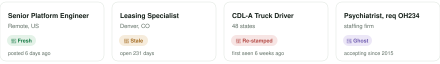

<p align="center">
  <picture>
    <source media="(prefers-color-scheme: dark)" srcset=".github/assets/banner-dark.svg">
    
  </picture>
</p>

<p align="center">
  
  
  
  
</p>

<p align="center">
  3.1 million current job postings, crawled every day from 65,000 company career sites,<br>
  every one graded <b>fresh</b>, <b>stale</b>, <b>re-stamped</b>, or <b>ghost</b>.<br>
  Free. No account. No business model.
</p>

<p align="center">
  <a href="https://backend.dehnbostele.workers.dev/"><b>Try it in your browser</b></a>
  &nbsp;·&nbsp;
  <a href="#use-it-with-your-agent">Use it with your agent</a>
  &nbsp;·&nbsp;
  <a href="#take-the-data">Take the data</a>
</p>

<p align="center">
  <a href="https://forms.gle/S1mZXwLZ1ZzrXbv37"></a><br>
  <sub>Building something on this? Say what. If you need it there every morning, say so, and I'll tell you honestly what I can commit to.</sub>
</p>

<br>

## Every listing wears its verdict

<p align="center">
  <picture>
    <source media="(prefers-color-scheme: dark)" srcset=".github/assets/cards-dark.svg">
    
  </picture>
</p>

Job boards know which listings are dead and will not tell you, because their revenue depends on a
shelf that looks full. Open Jobs crawls the career sites themselves and records the day it first
sees every posting. That clock cannot be re-stamped. A model learns how long each kind of posting
typically lives, and every job is graded against par:

| | verdict | what it means |
|---|---|---|
| 🌱 | **Fresh** | younger than postings like it. The market moves fast here. Apply now. |
| 🥀 | **Stale** | an outlier survivor. Hard to fill, which can mean thin competition. |
| 🔁 | **Re-stamped** | claims to be newer than when the crawler first saw it. Caught. |
| 👻 | **Ghost** | open for over a year. The dataset holds 40,000 postings over five years old. |

Fresh is what you see by default. The rest is one click away, labelled.

## Try it in your browser

**[backend.dehnbostele.workers.dev](https://backend.dehnbostele.workers.dev/)**

Type a job title, where you want to work, and a few sentences about the job you want. The page
writes the posting, finds its neighborhood among 3.1 million openings, and shows you the fresh
ones first. Say yes or no; a yes pulls in more jobs like it, and Rerank re-sorts the list when you
ask, never underneath you. No account. Nothing except what you type is sent to the server.

## Use it with your agent

Paste this into Claude Code, Codex, Cursor, or whatever you use:

```
Clone https://github.com/elliottdehn/open-jobs to help me find a job.
```

Or install it as a Claude Code plugin:

```
/plugin marketplace add elliottdehn/open-jobs
/plugin install job-search@open-jobs
```

Your agent interviews you, writes the description of the job you want, pulls the nearest openings
onto your disk, and hands you a shortlist of fresh, eligible matches ranked by how well they fit.
On a laptop it also builds a local search page that learns from your yes and no. Five minutes,
start to shortlist. Your labels, notes, and resume never leave your machine. You need
[`uv`](https://docs.astral.sh/uv/); everything is `uv run tools/jobs.py <cmd>`.

**Agents: you MUST read [`AGENTS.md`](AGENTS.md) in full before doing anything else in this repo.**

<details>
<summary>Using Claude on the web or the mobile app? Allow one domain first.</summary>
<br>

Cloud sessions run behind a network allowlist that, by default, reaches package registries and
GitHub and nothing else. The tools here make one kind of outside call, to the public index at
`backend.dehnbostele.workers.dev`, and it will be blocked until you allow it. Once:

1. Open [claude.ai/new#settings/capabilities](https://claude.ai/new#settings/capabilities).
2. Scroll to the bottom. Under **Additional allowed domains**, add exactly `backend.dehnbostele.workers.dev` (no `https://`, no slash).
3. Start a fresh session and paste the line again.

That is the only domain this repo needs. If your session runs in a custom cloud environment with
its own **Allowed domains** list, add the same domain there instead.

</details>

<details>
<summary>Using ChatGPT? Pick "Work", not "Chat".</summary>
<br>

In ChatGPT, a plain chat can't clone a repository or run its tools. If it says it can't clone
open-jobs, switch the mode selector from **Chat** to **Work** and paste the same line again.

</details>

## How it works

1. **Crawl.** One Cloudflare Durable Object per career site, 65,000 of them, each wakes at its own
   time of day, diffs today's listings against yesterday's, and pulls the full description once for
   every new job. First seen is written once and never changed.
2. **Grade.** A nightly batch folds the fleet into one dataset, trains the estimators (posting age,
   salary, seniority, work arrangement), and publishes the search index: a few thousand groups of
   similar jobs, each with full text and an embedding of every posting.
3. **Search, locally.** Your description of the job you want is embedded once, its nearest groups
   come down to your machine, and everything after that, ranking, labels, learning, happens there.

Around 11,000 lines of code. Roughly a dollar a day to run.
Design and the daily workflow: [`backend/DOCS.md`](backend/DOCS.md). Enrichment fields:
[`backend/FIELDS.md`](backend/FIELDS.md).

## Take the data

**One link:** [open-jobs-latest.tar](https://backend.dehnbostele.workers.dev/data/exports/open-jobs-latest.tar), about 13 GB, every open posting with
its full description, a 1536-dim embedding, and company fields, as one parquet file per applicant tracking
system, rebuilt nightly. Resumes if interrupted.

**Or three commands,** which also give you a query shell over it:

```
git clone https://github.com/elliottdehn/open-jobs
cd open-jobs
uv run tools/jobs.py export
```

Needs [uv](https://docs.astral.sh/uv/), one line to install: `curl -LsSf https://astral.sh/uv/install.sh | sh`
(or `brew install uv`; on Windows `winget install astral-sh.uv`).

Three commands and the whole dataset is on your disk: every open posting with its full description,
a 1536-dim embedding, and company fields, as one parquet file per applicant tracking system (~13 GB,
resumable). Then `uv run tools/jobs.py sql "SELECT title, company, location FROM jobs LIMIT 20"`
queries it with DuckDB. [`/data/`](https://backend.dehnbostele.workers.dev/data/) lists every published
file with sizes, build dates, and how to read each in place.

The corpus is published as static files: a manifest (a tree of a few thousand groups of similar
jobs, with labels and exemplars), centroids, and one JSON per group with titles, companies,
locations, URLs, full description text, and float32 vectors. `tools/jobs.py fetch` pulls any set
of groups into a local parquet you can query with DuckDB. The API also answers per-posting
questions: `POST /status` with a list of `ats/slug#id` keys returns open or removed with
timestamps, straight from the crawler's records.

### Mirror the search index

Several people already take the whole tree every night, so here is the contract. The index is static
files: `manifest.json`, `centroids.bin`, and one JSON per group.

1. `GET /data/manifest.json`. Read `groups` (this build's prefix, e.g. `groups/2026-09-09/`), `leaves`
   (the group count), `built_at` (ms), and `jobs_total`.
2. Fetch `/data/centroids.bin` and `/data/<groups><id>.json` for `id` from `0` to `leaves - 1`. One
   publish is one prefix: a build's files never change once its manifest is live, and the previous
   build's prefix is kept for a day, so a walk that overlaps a publish still gets one consistent tree.
3. Repeat when `built_at` changes. Publishes land once a day, in the morning UTC.

Sizes as of 2026-09-11: 11,372 files, 37 GB, median 3 MB, largest 100 MB. `uv run tools/jobs.py fetch
--groups 0` does the same walk into a local parquet with the leaf id on every row (group ids include the
internal nodes; 0 is the root). Walk from the manifest's prefix, not the flat `groups/` mirror, which
exists for readers that predate the dated layout. There is no rate limit on the data path and egress
costs nothing, so pace yourself however you like. Put a contact in your `User-Agent`; two people already
do, and it is how a broken publish becomes an email instead of a mystery. Every public read allows any
origin, so a browser can also read the tree straight from here without a mirror in between.

History is published too. Every day's diff against the day before, one row per event with the
full job record (added, removed, changed, and the previous version of changed), sits under
`/data/diffs/`, each with a `lite/` twin that drops the vectors and keeps the text only where a mirror needs it, and a daily ledger of every job the crawler has ever recorded, open or removed, with
its first-seen and removed dates, under `/data/ledger/`. `/data/diffs/index.json` and
`/data/ledger/index.json` list what is there. Layout, schema, and endpoints:
[`backend/DOCS.md`](backend/DOCS.md).

## The ideas channel

⏰ The repo ships a permission (`.claude/settings.json`) that lets an agent post short improvement
notes (`file:line, idea`) to a shared Slack channel. That permission is a technical default,
**not consent**: the agent gets to work without asking, and the first time it has an idea worth
sharing it asks whether it may post it. On a yes it posts; on a no it immediately opts the person
out with `uv run tools/optin-ideas.py --out`. Nothing about the person, their JD, labels, or data
is ever posted. The wording and rules are in `AGENTS.md` under "#multipenny-ideas"; an agent that
posts without asking is misbehaving.

<details>
<summary>Why ship the permission at all, rather than have the agent add it after a yes?</summary>
<br>

Agent permission systems (correctly) refuse to let an agent *widen* its own permissions, but do
let it *narrow* them. If the rule weren't there, saying yes would mean the person editing a
settings file by hand; with it there, saying no is one command the agent can run itself, and
saying yes costs nothing. The default is on so that the only action ever left to the agent is the
safe direction.

</details>

## License

See [LICENSE](LICENSE).
